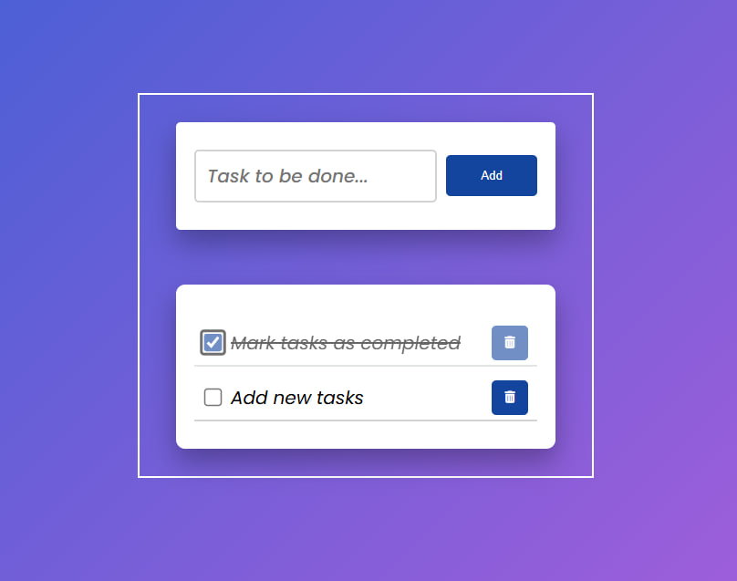

# Todo App

A simple and intuitive Todo application for managing daily tasks. Users can create, complete, and remove tasks with persistent storage using LocalStorage.

## Features

- Add new tasks
- Mark tasks as completed
- Delete tasks
- Save tasks using LocalStorage
- Responsive design

## Tech Stack

- React
- TypeScript
- Vite
- Biome
- LocalStorage

## Installation

```bash
npm install
npm run dev
npm run check
npm run build
```

## Purpose

This project focuses on:

- Dynamic UI updates
- State handling
- LocalStorage integration

## Preview


